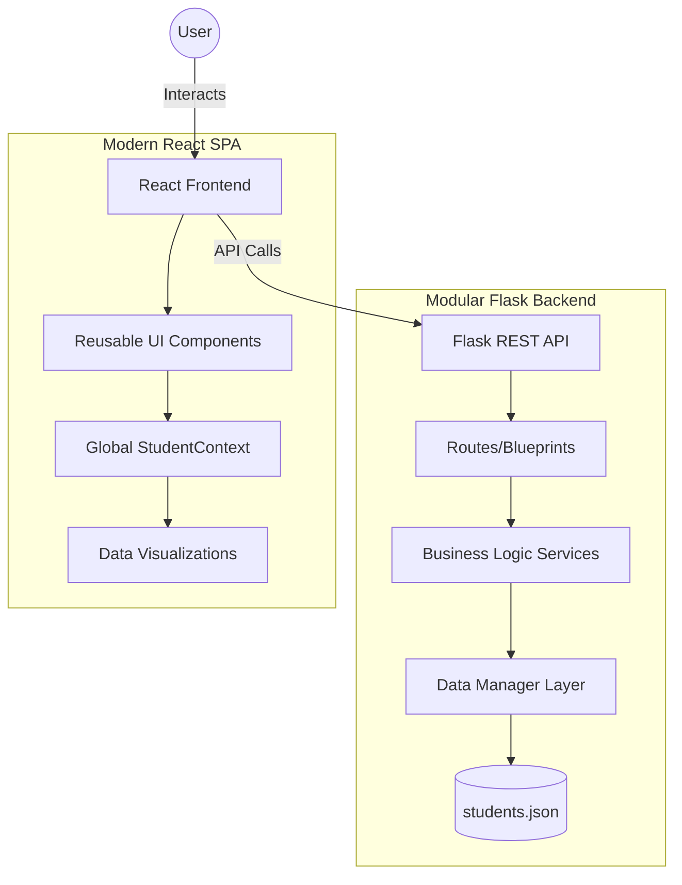

# Student Analytics Pro (Enterprise Edition) 🎓📊

**Student Analytics Pro** is a high-performance, enterprise-grade educational management system designed to transform raw academic data into meaningful insights. Built with a modular service-oriented architecture, it provides educators with a professional suite of tools for student tracking, performance visualization, and record management.

---

## ✨ Key Features

- 🚀 **Extreme Scaling**: Modular backend with separate Routing, Service, and Data layers.
- 📈 **Power Visualizations**: Advanced Dashboard featuring **Recharts** (Bar & Pie Charts) for system-wide performance tracking.
- 📂 **Full CRUD Management**: Streamlined Student Directory with inline editing, search, and confirmation-protected deletion.
- ⚡ **Dynamic Subject Support**: Scalable logic that automatically adapts to any number of subjects (Math, Physics, English, Bio, Chem, etc.).
- 🌐 **Modern SPA Architecture**: Multi-page experience powered by `react-router-dom` and Global Context API state management.
- 🎨 **Premium UI/UX**: Dark-mode glassmorphism design with Lucide-icons, smooth animations, and responsive layouts.
- 🔐 **Simulated Session Management**: Integrated Login/Logout flow for secure system simulation.

---

## 🛠 Tech Stack

### Frontend
- **React.js**: Modern UI library with Hooks.
- **Vite**: Ultra-fast build tool and dev server.
- **Recharts**: D3-based charting for data visualization.
- **Lucide-React**: Beautifully simple pixel-perfect icons.
- **Context API**: Global state management without Prop Drilling.

### Backend
- **Flask**: Python micro-framework for the REST API.
- **Service Pattern**: Business logic encapsulation for scalability.
- **Blueprint Routing**: Clean separation of API concerns.
- **JSON Engine**: Atomic file I/O operations for data persistence.

---

## 🏗 System Architecture

The project follows a clean, decoupled architecture to ensure separation of concerns and high scalability.

### 📂 Key Modules Breakdown

#### **Backend Layer**
- **`main.py`**: The application factory that initializes the Flask app and registers blueprints.
- **`routes/`**: Handles incoming HTTP requests and maps them to service functions.
- **`services/student_service.py`**: The "brain" of the app. It calculates grades, averages, and processes raw marks into analytics.
- **`data/json_manager.py`**: Provides an abstract layer for interacting with the JSON data store, ensuring thread-safe reads/writes.

#### **Frontend Layer**
- **`StudentContext.jsx`**: Manages the global state (students data, loading states, auth status) using React Context API.
- **`Dashboard.jsx`**: A complex analytic hub using `recharts` to provide visual feedback on class performance.
- **`StudentDirectory.jsx`**: An administrative panel supporting inline CRUD operations for rapid data entry.

---

## 🚀 Getting Started
... [Setup instructions same as before] ...

---

## 🎯 Why This Tech Stack?

- **React + Vite**: Chosen for its industry-leading developer experience and lightning-fast HMR (Hot Module Replacement), allowing for rapid prototyping of complex UIs.
- **Flask**: A lightweight but powerful Python framework that allows for clean, explicit service-oriented backend logic.
- **Recharts**: Provides a declarative way to build complex, responsive charts that feel native to the React ecosystem.
- **Tailored CSS**: Using custom CSS ensures maximum performance and complete control over the "Glassmorphism" design system without the overhead of massive UI libraries.

---

## 🛣 Future Roadmap

- [ ] **Database Integration**: Transition from JSON to PostgreSQL/MongoDB for high-concurrency environments.
- [ ] **Auth 2.0**: Implementation of JWT-based authentication and Role-Based Access Control (RBAC).
- [ ] **PDF Reporting**: Automated generation of student report cards in PDF format.
- [ ] **AI Insights**: Using Python's ML libraries to predict student performance trends.

---

## 📸 System Overview

  <h3>Professional Dashboard</h3>

  
<i>Real-time class performance tracking and grade distribution metrics.</i>

  
   
  
  <h3>Administrative Directory</h3>
  
<i>Full CRUD management with inline editing and advanced search.</i>

---

## 📄 License
This project is licensed under the MIT License - see the [LICENSE](LICENSE) file for details.

---

## 🤝 Contributing
Contributions are welcome! Please open an issue or submit a pull request for any enhancements.

---
**Analytics Pro** - Built with ❤️ for the future of Education.

